# Scoring Reference

Scoring in Koi-Koi is done when a player creates one or more matched sets or yaku(役)

## Yaku List

### Gokō (五光) "Five Bright" 10pts

All 5 bright cards

  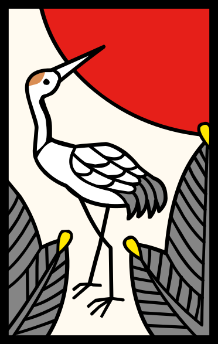
  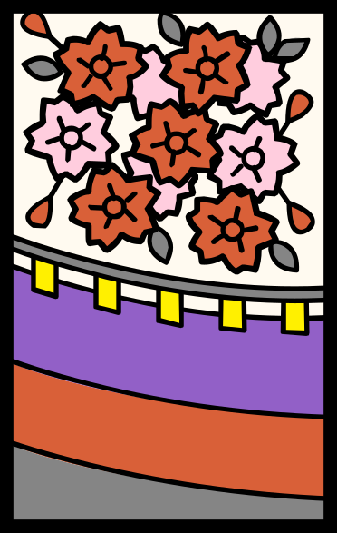
  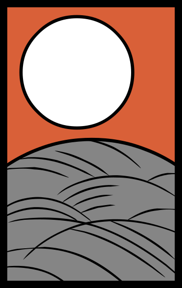
  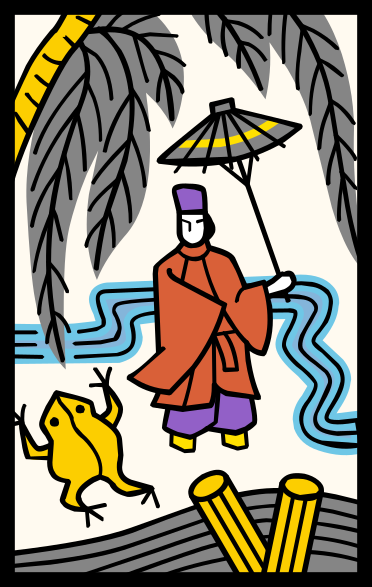
  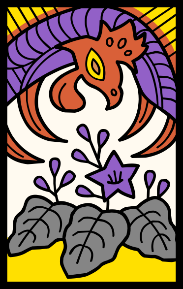

### Akatan Aotan no Chōfuku (赤短・青短の重複) "Red Poetry and Blue Tanzaku Combination" 10pts

All 3 red poetry tanzaku and all 3 blue tanzaku. Replaces Akatan and Aotan

  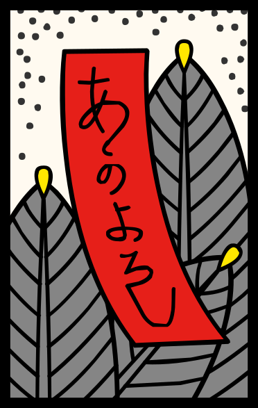
	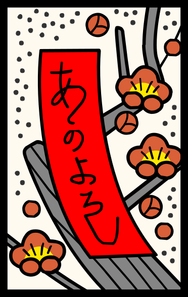
	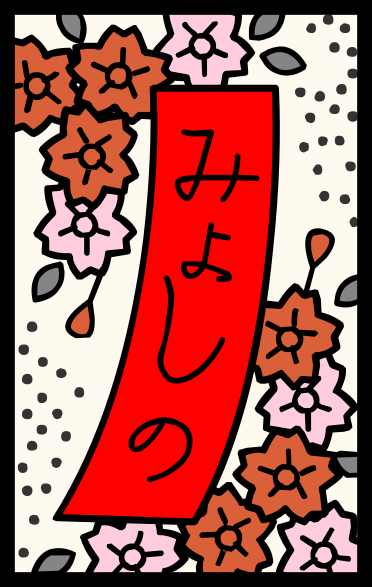
	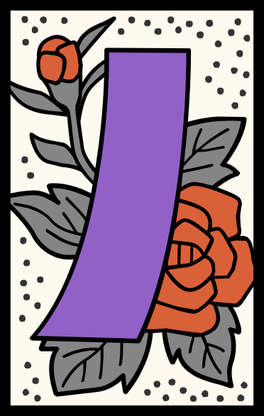
	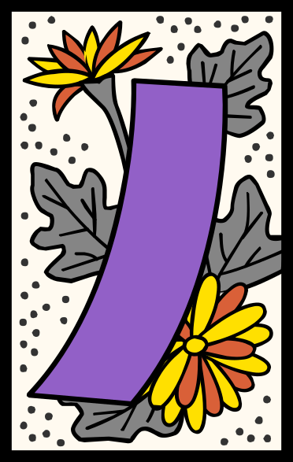
	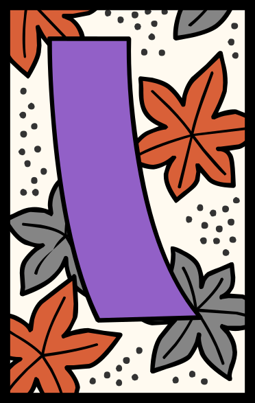

### Shikō (四光) "Dry Four Bright" 8pts

4 Bright cards with the exception of Ono no Michikaze "Rain man" card

  
  
  
  

### Ame-Shikō (雨四光) "Rainy Four Bright" 7pts

Any four bright cards including Ono no Michikaze "Rain man"

  
  
  
  

### Sankō (三光) "Dry Three Bright" 5pts

Any three bright cards not without Ono no Michikaze "Rain man"

  
  
  

### sukimi-zake (月見酒) "Moon Viewing" 5pts

Full moon and sake cup cards

	
	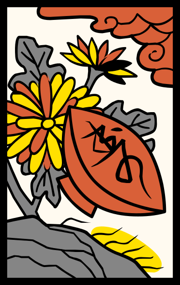

### Hanami-zake (花見酒) "Cherry Blossom Viewing" 5pts

Curtain and sake cup cards

	
	

### Inoshikachō (猪鹿蝶) "Boar, Deer, Butterflies" 5pts

The Boar, Deer, and Butterflies animal cards

	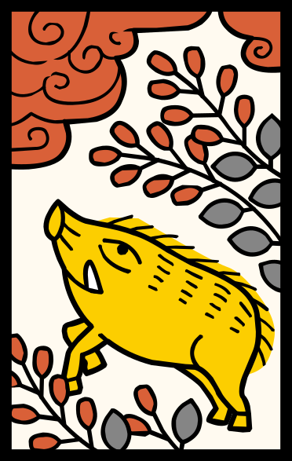
  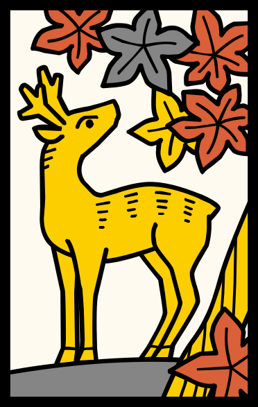
  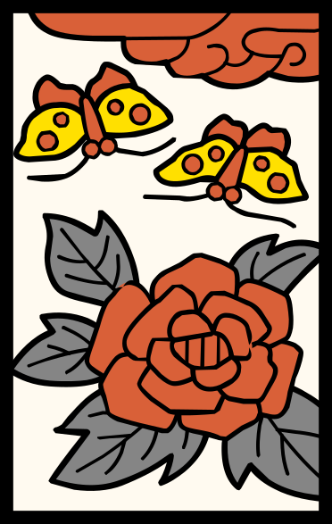

### Akatan (赤短) "Red Poetry Tanzaku" 5pts

All three red poetry tanzaku cards

	
	
	

### Aotan (青短) "Blue Tanzaku" 5pts

All three blue tanzaku cards

	
	
	

### Tane (タネ) 1pt

Any five animal cards, including the sake cup and eight-plank bridge, one additional point is added for each extra animal card

	
	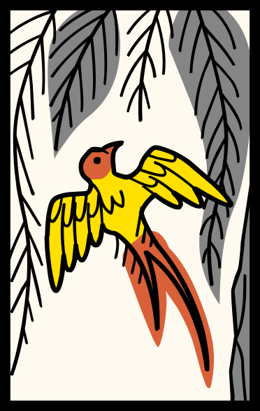
	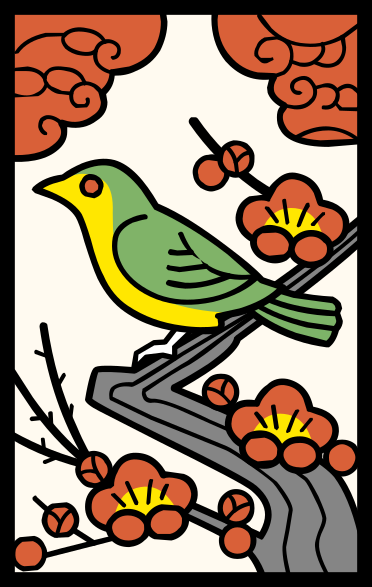
	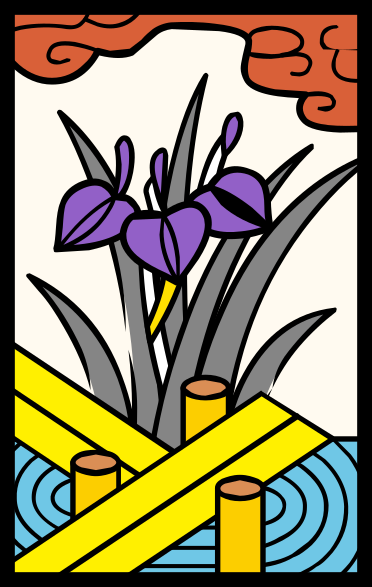
	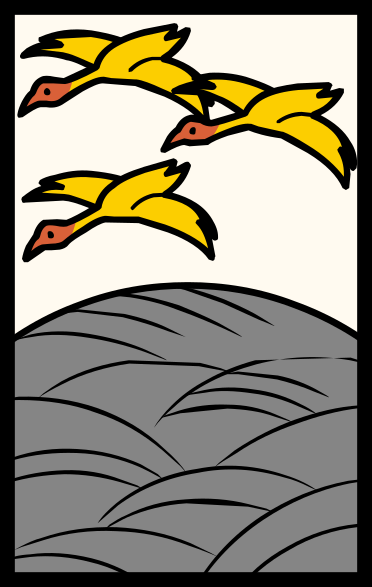

### Tanzaku (短冊) 1pt

Any five tanzaku cards, one additional point is added for each extra tanzaku card

	
	
	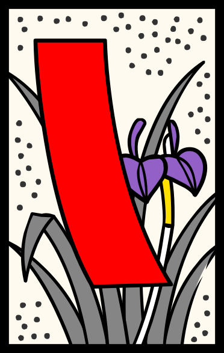
	
	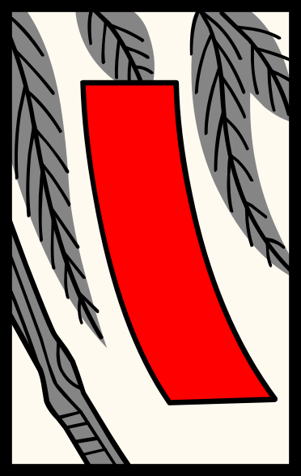

### Kasu (カス) 1pt

Any ten normal cards including the sake cup. One additional point is added for each additional normal card

	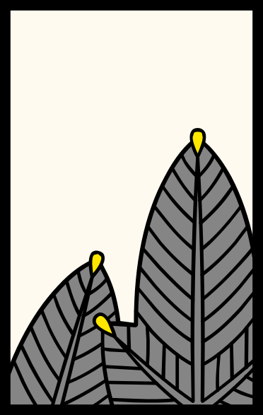
	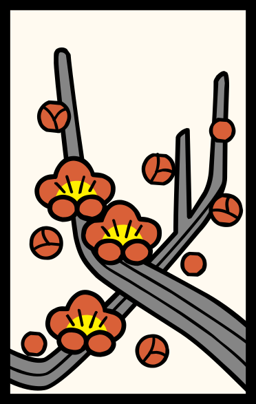
	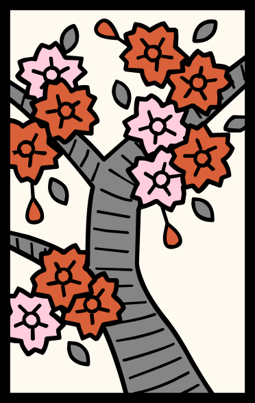
	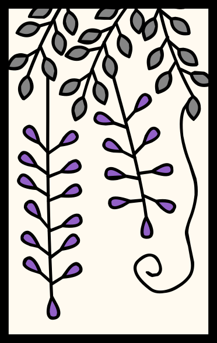
	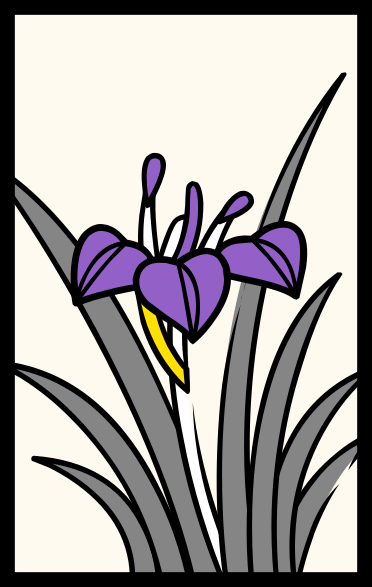

	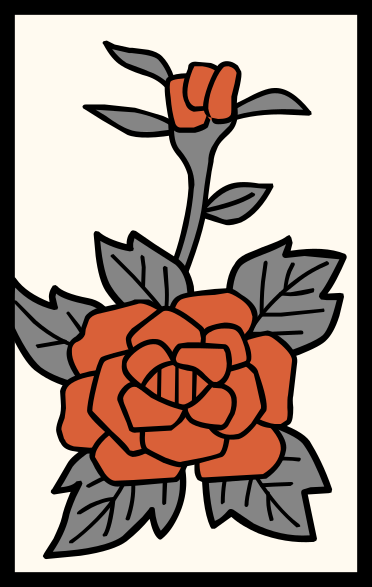
	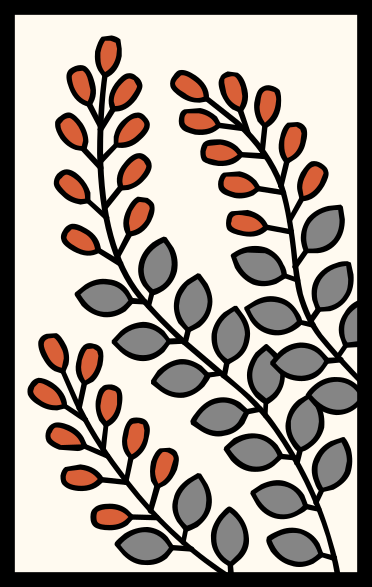
	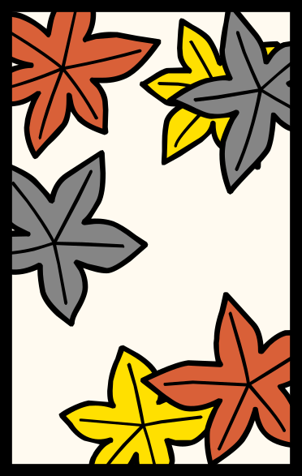
	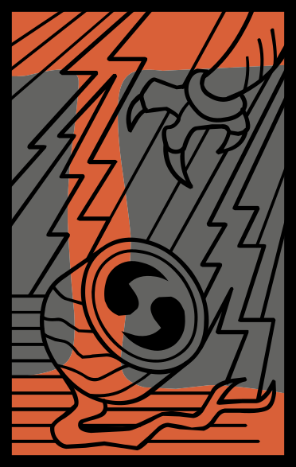
	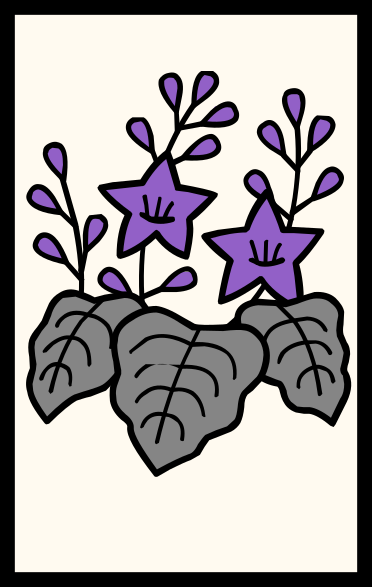

